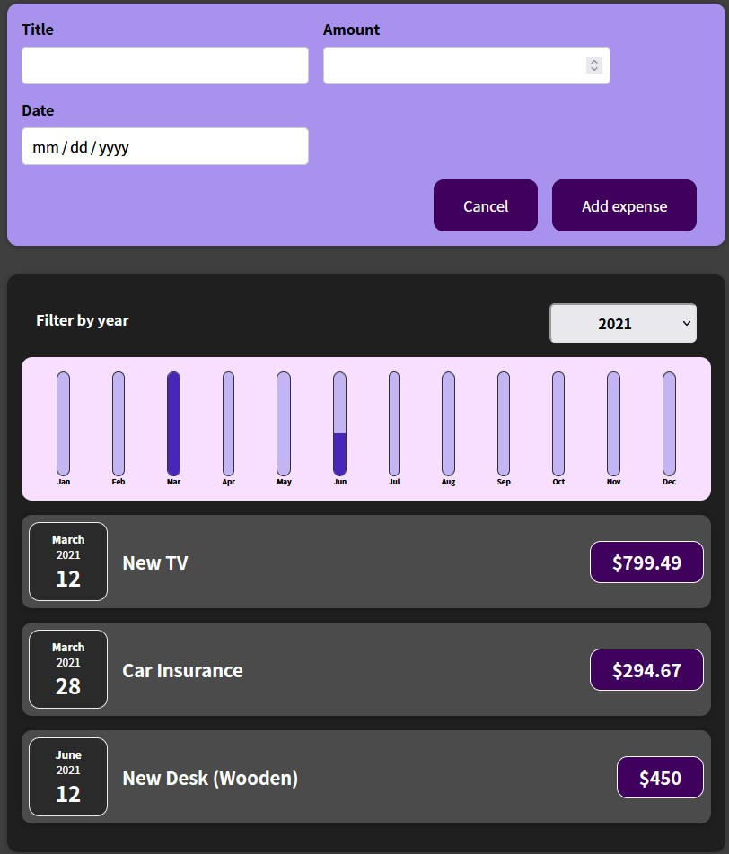

# Here is a collection of my React projects 

## First: 01-starting-setup
This is my first React project, it's an expense tracker where I've learned the basics of manageing states, pass props between parent and child and components basics. The takeaway from this projects is managing components, state, on-way and two-way but also stateful and state-less components. 

### Functionality wise
We can add expenses, filter by year, see the expenses filtered by month